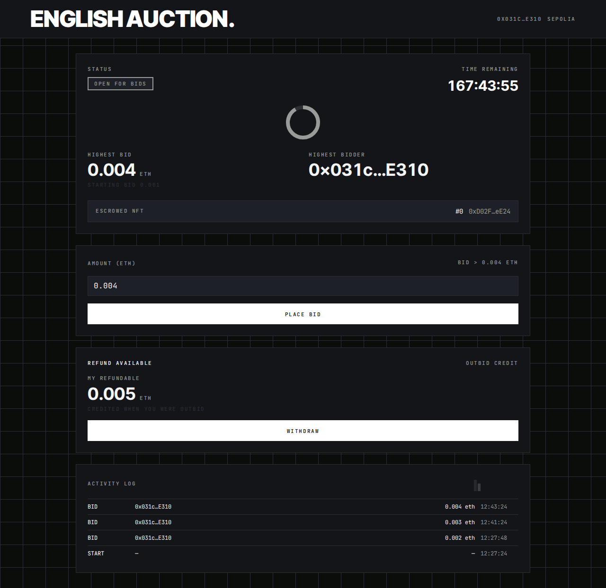

# English Auction

A single-page on-chain English auction with a strictly monochrome **"Caliper"**
instrument UI — hairline grids, grayscale signal bars, mono labels, **zero
chromatic pixels** — over two Solidity contracts, with the chain hosted
server-side so visitors never run a node.

[](https://english-auction-nine.vercel.app)
[](#validation)
[](#validation)
[](contracts/)

**▶ Try it live: <https://english-auction-nine.vercel.app>** (Sepolia, chainId
11155111) — connect a wallet, follow the guided add/switch-network prompt, and
bid; the current demo auction closes **Oct 4, 2026, 12:27 UTC**, after which
anyone can press *Settle* (it's permissionless).



## What's inside

| | |
|---|---|
| **Full auction lifecycle** | mint → `start()` (NFT escrow) → strictly-rising bids → `end()` payout (winner takes NFT, seller takes ETH) → refunds for outbid bidders |
| **Guided wallet onboarding** | connect → wrong-network detection → add/switch with an **absolute `https://<host>/rpc`** URL that real wallets accept |
| **Unified tx lifecycle** | one toast walks *awaiting → pending → confirmed*, with first-class *rejected* / *reverted* surfaces (FR-010) |
| **Live activity log** | Start/Bid/Withdraw/End decoded from chain logs, paged in provider-safe windows from the auction's deploy block |
| **Never a blank page** | boot and read failures collapse to a full-page, actionable error state that recovers on its own |
| **Runtime config** | chain + contract addresses served by `/api/config` — never baked into the bundle, so one build deploys anywhere |
| **Responsive** | full layout down to 360 px |

### Lifecycle & phases

```
NOT_STARTED ──start()──▶ OPEN_FOR_BIDS ──countdown ends──▶ AWAITING_SETTLEMENT ──end()──▶ SETTLED
   (mint)                  (bids revert)      (anyone settles)                (NFT↔payout)
```

When the countdown reaches zero nothing moves automatically: bids stop
reverting-into-place on-chain, the UI flips to the settle panel, and the first
`end()` transaction (permissionless, no deadline) awards the NFT and pays the
seller. Zero bids ⇒ the NFT simply returns to the seller.

## Architecture

```
┌────────────────────┐   same-origin: /api/config · /rpc · /*   ┌────────────────────┐
│  Browser           │ ───────────────────────────────────────▶ │  Backend           │
│  React 19 · wagmi  │ ◀── runtime config · proxied JSON-RPC ── │  Express 5         │
│  injected wallet   │                                          │  (api/*.ts funcs)  │
└────────┬───────────┘                                          └─────────┬──────────┘
         │  signed txs (EIP-1193 — MetaMask & co.)                        │ JSON-RPC
         └────────────────────────────────────────────────▶ chain ◀───────┘
                        Anvil (dev · chainId 2026) · Sepolia (production)
```

The browser never sees a raw node URL or a baked address: reads and writes go
through the same-origin `/rpc` proxy, addresses come from `/api/config` at boot,
and the wallet signs natively.

| Layer | Tech |
|-------|------|
| Contracts | Foundry · solc **0.8.31** (exact-pinned) · OpenZeppelin **v5.7.0** · forge-std v1.16.2 |
| Frontend | React 19 · Vite 7 · wagmi v3 / viem 2 · TanStack Query 5 · Tailwind CSS v4 · Vitest 5 |
| Backend | Node ≥ 20 · Express 5 — serves the SPA, `/api/*`, proxies `/rpc` |
| Chain | Dev: Anvil (chainId **2026**), hosted server-side with state persistence · Prod: any EVM chain (Sepolia live) |
| Tooling | Spec Kit (spec → plan → tasks) · ESLint (zero warnings) · `scripts/check.sh` (9 gates) |

## Quickstart — development

```bash
npm install
./scripts/start-chain.sh        # terminal 1 — anvil :8545 (state persists across restarts)
./scripts/deploy.sh             # one-shot: deploy contracts → backend/.env
npm run dev                     # backend :3000 + frontend :5173 (Vite proxies to backend)
```

`scripts/deploy.sh` reads:

| Env | Default | Purpose |
|-----|---------|---------|
| `DURATION_SECONDS` | `604800` (7 d) | auction length — use `DURATION_SECONDS=60` for a 60 s demo |
| `STARTING_BID_WEI` | `10^15` (0.001 ETH) | minimum first bid |

Chain state lives in `.anvil/state.json` — `start-chain.sh` loads it on boot and
anvil re-dumps it on stop (`--dump-state`), so deployed contracts survive
restarts. Reset with `rm -f .anvil/state.json` + redeploy.

## Deployment

### A. Single host (self-managed)

```bash
./scripts/start-chain.sh        # chain with persistence
./scripts/deploy.sh             # writes backend/.env (addresses, chainId, rpcUrl)
npm run build -w frontend       # SPA → frontend/dist (served by the backend)
npm start                       # backend :3000 — SPA + /api/* + /rpc proxy
```

Put it behind an HTTPS reverse proxy (Caddy/nginx) — HTTPS is required for
`wallet_addEthereumChain` in most wallets. The node itself stays localhost-bound;
only the proxy is public.

### B. Vercel (serverless — **live**)

The serverless adaptation lives in [`api/`](api/): three path-agnostic functions
reusing the shared Express app (`backend/src/vercel.ts` rebases each request to
its owned route, so `/rpc` works through the `vercel.json` rewrite under any URL
semantics), plus [`vercel.json`](vercel.json) (Vite build → `frontend/dist`,
`/rpc` rewrite + SPA history fallback). Runbook (executed 2026-09-27, T069 —
25/25 remote checks green):

1. `npm i -g vercel` → `vercel link` → set project env vars:
   `ANVIL_URL` (remote RPC — must accept **≥5,000-block `eth_getLogs` ranges**;
   Alchemy Free's 10-block cap is too small), `CHAIN_ID`, `CHAIN_NAME`,
   `AUCTION_ADDRESS`, `NFT_ADDRESS`, `DEPLOYED_AT`, `DEPLOY_BLOCK` (auction
   creation block — activity-log paging), optionally
   `NATIVE_CURRENCY_NAME/SYMBOL/DECIMALS`.
2. Deploy the contracts (individual `cast send --create` transactions —
   multi-tx `forge script` broadcast trips delegated-account in-flight limits),
   then `approve()` + `start()` the auction as the seller; put the addresses and
   the auction's creation block into the env vars.
3. `vercel deploy --prod` — remote verification covers V1 (cold load + guided
   add/switch carrying the absolute `https://<host>/rpc`), V4 (real bids through
   the public proxy) and V8 (chain-unreachable → recovery), plus SPA deep links.

Live deployment: **<https://english-auction-nine.vercel.app>**
· auction `0x8251a9C764236E2D53bdce65C49000CCaDccFc74` ·
NFT `0xd02f9fc480be6351cee993f49abaee68c0b9ee24`

## Validation

```bash
./scripts/check.sh   # 9 gates — ALL must be green
```

| # | Gate | Constitution |
|---|------|--------------|
| 1–3 | `forge fmt --check`, `forge lint`, exact-pinned solc build, zero warnings | I |
| 4 | `forge test` — unit + fuzz (500 runs) + invariant (64×32) | II/III |
| 5 | `forge coverage` ≥95 % lines / ≥90 % branches over `contracts/src` | III |
| 6 | ESLint frontend + backend, zero warnings | I |
| 7 | frontend build + ≤300 KB gzip bundle budget (SC-006) | — |
| 8 | SC-004 palette: no color literal outside `src/styles/caliper.css` | — |
| 9 | Vitest coverage ≥95/90 for frontend **and** backend (thresholds enforced in config) | III |

Measured: contracts **100 % lines / 96 % branches** (49 tests), frontend
**98.9 % / 92.4 %** (218 tests), backend **96.0 % / 97.4 %** (38 tests).

Test-first is non-negotiable (constitution II): every change lands red before
green. End-to-end walkthroughs (V1–V9: lifecycle, refunds, settle, zero-bid,
failures, design/responsive) are scripted in
[`specs/001-auction-web-ui/quickstart.md`](specs/001-auction-web-ui/quickstart.md);
known debt lives in [`docs/tech-debt.md`](docs/tech-debt.md).

## Project structure

```
contracts/   Foundry — EnglishAuction + SolimanWeb3 (pinned solc, fuzz/invariant suites)
frontend/    React SPA — sections, hooks (wagmi), Caliper styles, Vitest suites
backend/     Express — SPA hosting, /api/* runtime config, /rpc proxy (+ Vercel layer)
api/         Vercel functions — thin rebase onto the shared Express app
scripts/     start-chain · deploy · check (9 quality gates) · sync-abi
specs/       Spec Kit: spec.md · plan.md · tasks.md · quickstart.md
docs/        tech-debt ledger · demo assets
```

## Spec-driven workflow

Spec → plan → tasks live in [`specs/001-auction-web-ui/`](specs/001-auction-web-ui/);
project principles (code quality, test-first, coverage, maintainability,
documentation) in [`.specify/memory/constitution.md`](.specify/memory/constitution.md).
All 70 plan tasks are complete.
